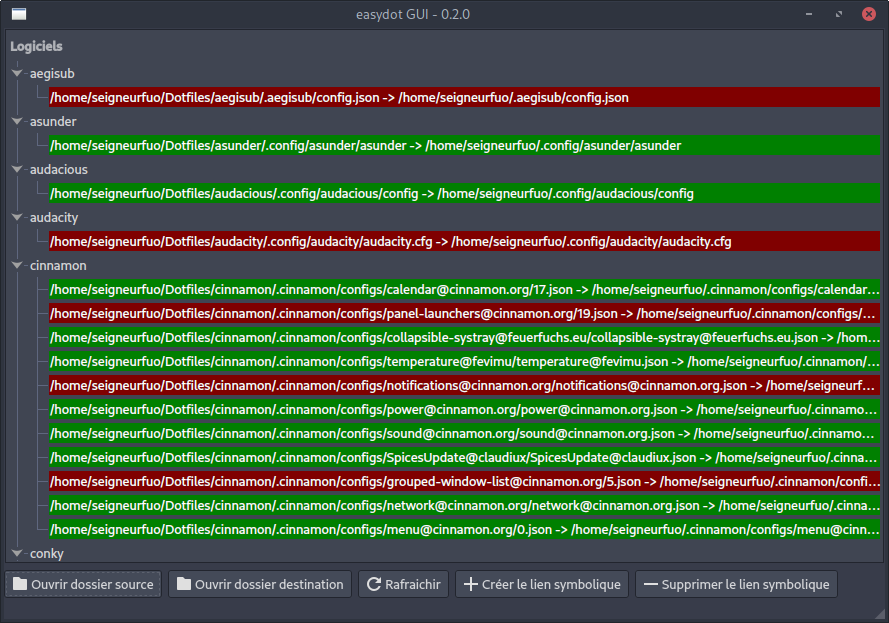

# EasyDot - Gérer facilement ses fichiers de configuration

## EasyDot CLI

Pour le moment, seule cette version permet de créer les liens symboliques.

### Utilisation:

```sh
easydot.py nom_du_dossier_logiciel
```


## EasyDot GUI

Cette version ne permet pour le moment que de visualiser les liens (valides, corrompus ou inexistants).


